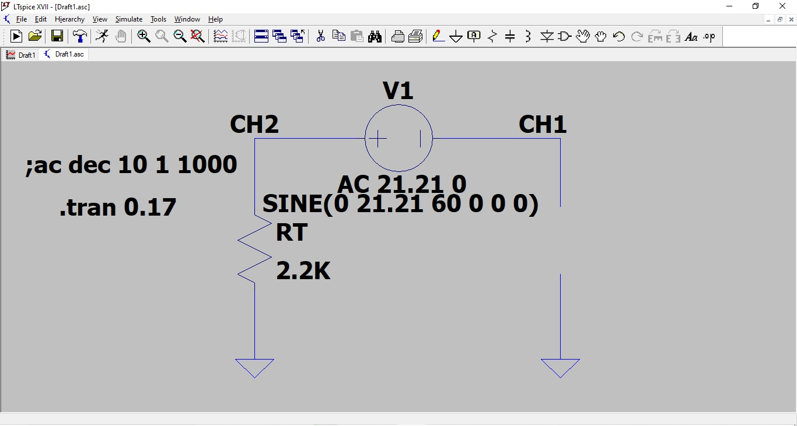
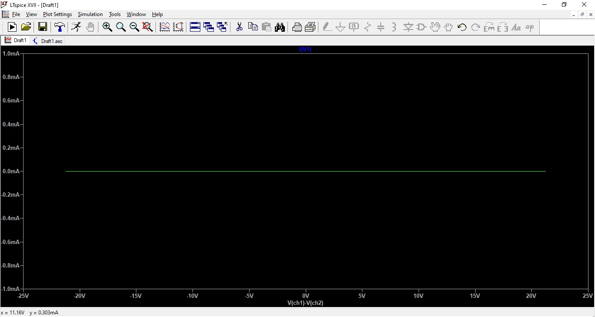
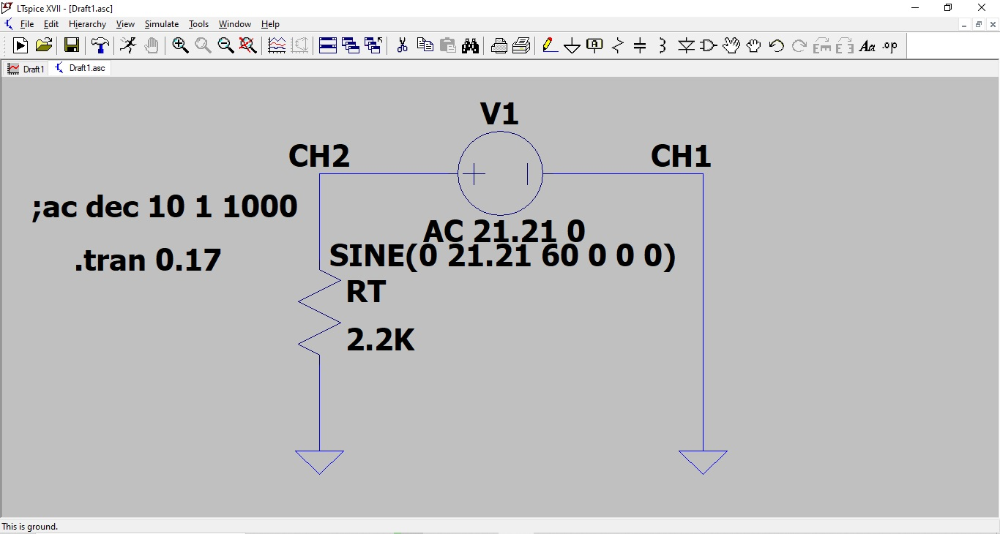
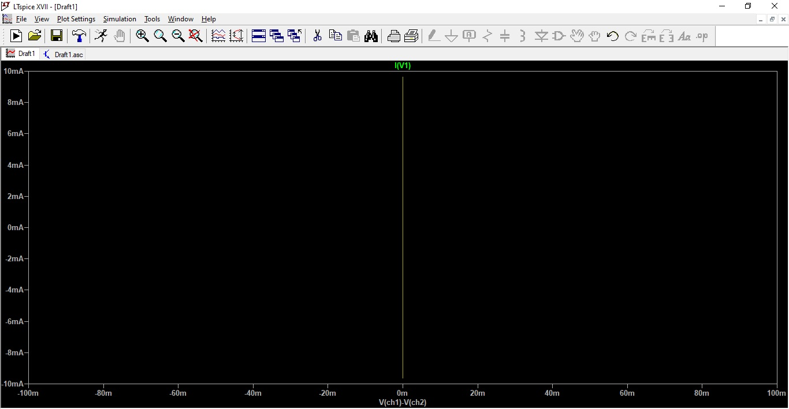
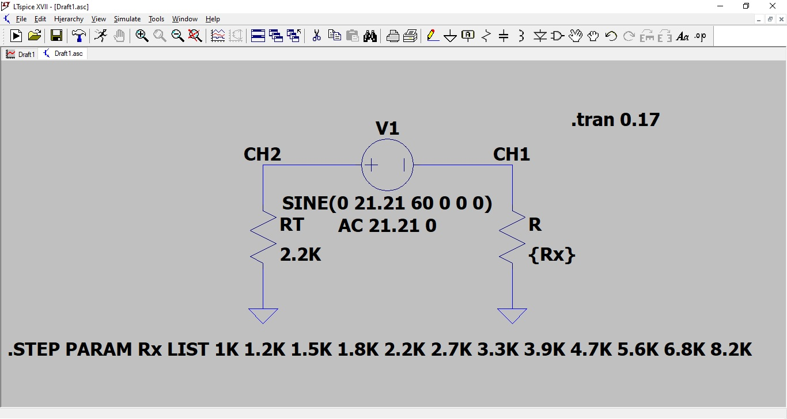
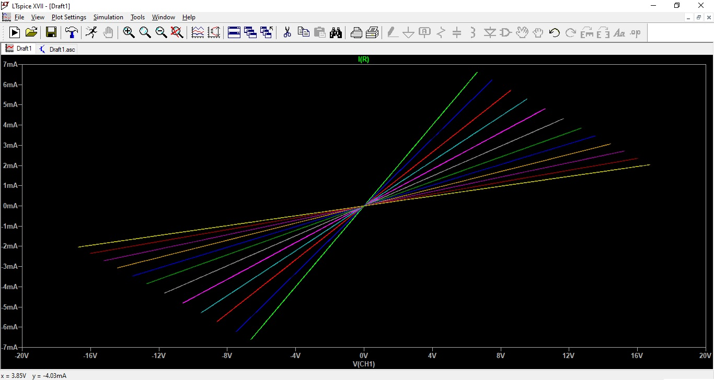

\thispagestyle{empty}

\newpage
\pagenumbering{roman}

```{=latex}
\setcounter{tocdepth}{4}
\renewcommand{\contentsname}{SUMÁRIO}
\tableofcontents
```

\newpage

```{=latex}
\setcounter{tocdepth}{4}
\renewcommand{\listfigurename}{LISTA DE FIGURAS}
\listoffigures
```

\newpage

```{=latex}
\setcounter{tocdepth}{4}
\renewcommand{\listtablename}{LISTA DE TABELAS}
\listoftables
```

```{r Pacotes, message=FALSE, warning=FALSE, echo=FALSE}
library(knitr)
library(rmarkdown)
library(readr)
library(tibble)
library(magrittr)
library(dplyr)
library(tidyr)
library(data.table)
library(janitor)
library(mice)
library(DescTools)
```

\newpage
# INTRODUÇÃO

## Experimento
## Teoria

\pagenumbering{arabic}
\newpage

# OBJETIVO

- Implementar um traçador de curvas $V \times I$ para dispositivos de 2 terminais.\
- Obter as curvas caraterísticas de vários tipos de componentes, com especial ênfase em diodos.\

\newpage

# LISTA DE MATERIAIS

```{r Lista de materiais, echo=FALSE, message=FALSE, warning=FALSE}

#data.frame
Materiais <- c("Fonte de tensão de 15 Voltz",
               "Osciloscópio",
               "Multímetro da bancada",
               "Jumpers",
               "Protoboard",
               "Resistências de 2K Ohm",
               "Diodo",
               "Diodo zener")
QTD <- c(1,1,1,4,1,2,1,1)
tb_materiais <- data.frame(Materiais, QTD)

#Tabela
kable(tb_materiais, col.names = c("Materiais","QTD"),
      align = "cc", caption = "Lista de materiais")

```

\newpage

# DESENVOLVIMENTO
## Descrição do experimento
## Resultados

Comparando os resultados de cada experimento com sua simulação:\
- Desenho do circuito\
- Cicuito na prática do experimento\
- Resultado do experimento (gráfico)\
- Simulação (gráfico)\

\newpage

### Circuito aberto


{width=50%}


{width=40%}


\newpage


{width=40%}


{width=50%}


\newpage

### Curto-circuito


{width=50%}


{width=40%}


\newpage


{width=40%}


{width=50%}


\newpage

### Resistor


{width=50%}


{width=40%}


\newpage


{width=40%}


{width=50%}


\newpage

### Diodo no sentido direto
### Diodo zener no sentido direto
### Diodo zener no sentido direto em serie com resistor
### Diodo zener no sentido reverso em serie com resistor
### Diodo no sentido direto em serie com diodo zener no sentido direto
### Diodo no sentido direto em serie com diodo zener no sentido reverso
### Diodo no sentido direto em paralelo com diodo zener no sentido direto
### Diodo no sentido direto em paralelo com diodo zener no sentido reverso


\newpage

# CONCLUSÃO

\newpage

# BIBLIOGRAFIA