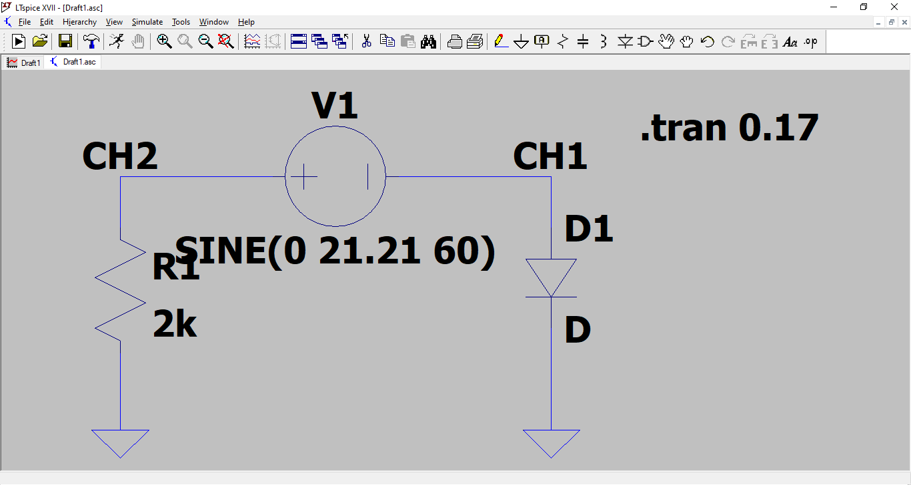
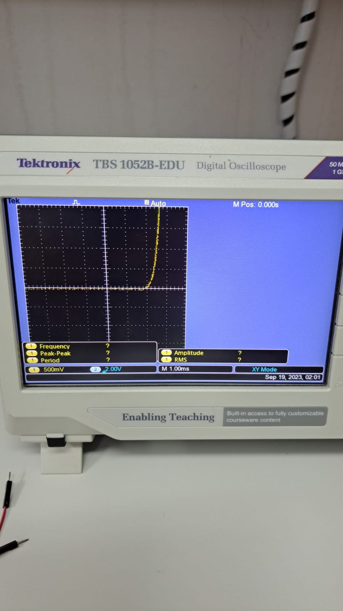
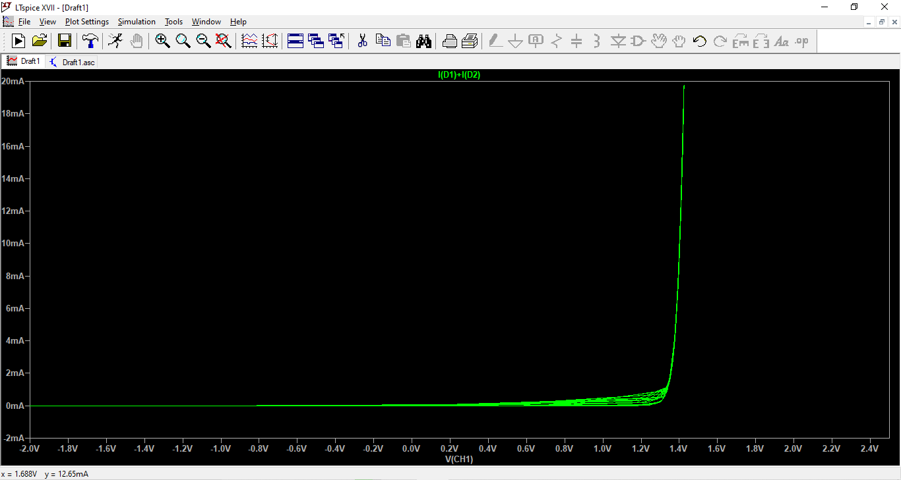

\thispagestyle{empty}

\newpage
\pagenumbering{roman}

```{=latex}
\setcounter{tocdepth}{4}
\renewcommand{\contentsname}{SUMÁRIO}
\tableofcontents
```

\newpage

```{=latex}
\setcounter{tocdepth}{4}
\renewcommand{\listfigurename}{LISTA DE FIGURAS}
\listoffigures
```

\newpage

```{=latex}
\setcounter{tocdepth}{4}
\renewcommand{\listtablename}{LISTA DE TABELAS}
\listoftables
```

```{r Pacotes, message=FALSE, warning=FALSE, echo=FALSE}
library(knitr)
library(rmarkdown)
library(readr)
library(tibble)
library(magrittr)
library(dplyr)
library(tidyr)
library(data.table)
library(janitor)
library(mice)
library(DescTools)
```

\newpage
# INTRODUÇÃO

## Experimento
## Teoria

\pagenumbering{arabic}
\newpage

# OBJETIVO

- Implementar um traçador de curvas $V \times I$ para dispositivos de 2 terminais.\
- Obter as curvas caraterísticas de vários tipos de componentes, com especial ênfase em diodos.\

\newpage

# LISTA DE MATERIAIS

```{r Lista de materiais, echo=FALSE, message=FALSE, warning=FALSE}

#data.frame
Materiais <- c("Fonte de tensão de 15 Voltz",
               "Osciloscópio",
               "Multímetro de bancada",
               "Jumpers",
               "Protoboard",
               "Resistências de 2K Ohm",
               "Diodo de silício",
               "Diodo zener")
QTD <- c(1,1,1,4,1,2,1,1)
tb_materiais <- data.frame(Materiais, QTD)

#Tabela
kable(tb_materiais, col.names = c("Materiais","QTD"),
      align = "cc", caption = "Lista de materiais")

```

\newpage

# DESENVOLVIMENTO
## Descrição do experimento

\newpage

## Resultados dos experimentos

### Circuito aberto

  O primeiro experimento foi projetado com o circuito aberto no lugar do dispositivo de teste, como pode ser observado pela figura \ref{circuito_aberto}. O circuito foi montado como apresentado na figura \ref{circuito_aberto_exp}. O resultado obtido pelo gráfico presente no osciloscópio é uma linha reta no eixo x, representando a tensão sobre o nó CH1, figura \ref{circuito_aberto_grafico_exp}, e o resultado esperado é o simulado computacionalmente pela figura \ref{circuito_aberto_simulado}.\
  Como pode ser observado, o gráfico obtido pelo osciloscópio e o simulado são semelhantes, mostrando que o experimento foi bem-sucedido.\

{width=50%}


{width=35%}


\newpage


{width=35%}


{width=50%}


\newpage

### Curto-circuito

  O segundo experimento foi projetado com o circuito em curto no lugar do dispositivo de teste, como pode ser observado pela figura \ref{curto-circuito}. O circuito foi montado como apresentado na figura \ref{curto-circuito_exp}. O resultado obtido pelo gráfico presente no osciloscópio é uma linha reta no eixo y, que representa a corrente que flui do nó CH1 para o terra, figura \ref{curto-circuito_grafico_exp}, e o resultado esperado é o simulado computacionalmente pela figura \ref{curto-circuito_simulado}.\
  Como pode ser observado, o gráfico obtido pelo osciloscópio e o simulado são semelhantes, mostrando que o experimento foi bem-sucedido.\

{width=50%}


{width=35%}


\newpage


{width=35%}


{width=50%}


\newpage

### Resistor


  O terceiro experimento foi projetado com uma resistência de $2.0K\Omega$ no lugar do dispositivo de teste, como pode ser observado pela figura \ref{circuito_resistivo}. O circuito foi montado como apresentado na figura \ref{circuito_resistivo_exp}. O resultado obtido pelo gráfico presente no osciloscópio é uma linha reta enclinada, que representa bem a relação da lei de Ohm, $V = R \times I$ [@johnson2015fundamentos], figura \ref{circuito_resistivo_grafico_exp}, e o resultado esperado é o simulado computacionalmente pela figura \ref{circuito_resistivo_simulado}.\
  Como pode ser observado, o gráfico obtido pelo osciloscópio e o simulado são semelhantes, mostrando que o experimento foi bem-sucedido.\

{width=50%}


{width=35%}


\newpage


{width=35%}


{width=50%}


\newpage

### Diodo no sentido direto

  O quarto experimento foi projetado com um diodo de silício, no sentido da corrente (direto), no lugar do dispositivo de teste, como pode ser observado pela figura \ref{circuito_diodo_direto}. O circuito foi montado como apresentado na figura \ref{circuito_diodo_direto_exp}. O resultado obtido pelo gráfico presente no osciloscópio é a curva exponencial característica do funcionamento de um diodo de silício com $V_k \thickapprox 0.7V$, figura \ref{circuito_diodo_direto_grafico_exp}, e o resultado esperado é o simulado computacionalmente pela figura \ref{circuito_diodo_direto_simulado}.\
  Como pode ser observado, o gráfico obtido pelo osciloscópio e o simulado são semelhantes, mostrando que o experimento foi bem-sucedido.\

{width=50%}


{width=35%}


\newpage


{width=35%}


{width=50%}


\newpage

### Diodo zener no sentido direto

  O quinto experimento foi projetado com um diodo zener, no sentido da corrente (direto), no lugar do dispositivo de teste, como pode ser observado pela figura \ref{circuito_zener_direto}. O circuito foi montado como apresentado na figura \ref{circuito_zener_direto_exp}. O resultado obtido pelo gráfico presente no osciloscópio é a curva exponencial característica do funcionamento de um diodo com $V_k \thickapprox 0.7V$, figura \ref{circuito_zener_direto_grafico_exp}, e o resultado esperado é o simulado computacionalmente pela figura \ref{circuito_zener_direto_simulado}.\
  Como pode ser observado, o gráfico obtido pelo osciloscópio e o simulado são semelhantes, mostrando que o experimento foi bem-sucedido.\

{width=50%}


{width=35%}


\newpage


{width=35%}


{width=50%}


\newpage

### Diodo zener no sentido direto em série com resistor

  O sexto experimento foi projetado com um diodo zener, no sentido da corrente (direto), em série com um resistor de $2.0K\Omega$, esses dois dispositivos no lugar do dispositivo de teste, como pode ser observado pela figura \ref{circuito_zener_direto_serie_resistor}. O circuito foi montado como apresentado na figura \ref{circuito_zener_direto_serie_resistor_exp}. O resultado obtido pelo gráfico presente no osciloscópio é um segmento de reta onde o diodo atua como uma bateria quando na região onde $V_k \thickapprox 0.7V$ associado a uma resistencia, apresentando assim um segmento de reta caracterísco da equação de Ohm para resistores (modelo de retas, ou segmentos lineares) [@sedra2007microeletrônica], figura \ref{circuito_zener_direto_serie_resistor_grafico_exp}, e o resultado esperado é o simulado computacionalmente pela figura \ref{circuito_zener_direto_serie_resistor_simulado}.\
  Como pode ser observado, o gráfico obtido pelo osciloscópio e o simulado são semelhantes, mostrando que o experimento foi bem-sucedido.\

{width=50%}


{width=35%}


\newpage


{width=30%}


{width=50%}


\newpage

### Diodo zener no sentido reverso em serie com resistor

  O sétimo experimento foi projetado com um diodo zener, no sentido da reverso, em série com um resistor de $2.0K\Omega$, esses dois dispositivos no lugar do dispositivo de teste, como pode ser observado pela figura \ref{circuito_zener_reverso_serie_resistor}. O circuito foi montado como apresentado na figura \ref{circuito_zener_reverso_serie_resistor_exp}. O resultado obtido pelo gráfico presente no osciloscópio é um segmento de reta onde o diodo zener atua como uma bateria quando na região ruptura onde $V_{ZK} \thickapprox -1.4V$ associado a uma resistencia, apresentando assim um segmento de reta caracterísco da equação de Ohm para resistores (modelo de retas, ou segmentos lineares) [@sedra2007microeletrônica] , figura \ref{circuito_zener_reverso_serie_resistor_grafico_exp}, e o resultado esperado é o simulado computacionalmente pela figura \ref{circuito_zener_reverso_serie_resistor_simulado}.\
  Como pode ser observado, o gráfico obtido pelo osciloscópio e o simulado são semelhantes, mostrando que o experimento foi bem-sucedido.\

{width=50%}


{width=35%}


\newpage


{width=30%}


{width=50%}


\newpage

### Diodo no sentido direto em série com diodo zener no sentido direto

  O oitavo experimento foi projetado com um diodo, no sentido direto, em série com um diodo zener, no sentido da direto, esses dois dispositivos no lugar do dispositivo de teste, como pode ser observado pela figura \ref{circuito_diodo_direto_serie_zener_direto}. O circuito foi montado como apresentado na figura \ref{circuito_diodo_direto_serie_zener_direto_exp}. O resultado obtido pelo gráfico presente no osciloscópio é a soma dos $V_K$, $V_K \thickapprox 1.4V$, figura \ref{circuito_diodo_direto_serie_zener_direto_grafico_exp}, e o resultado esperado é o simulado computacionalmente pela figura \ref{circuito_diodo_direto_serie_zener_direto_simulado}.\
  Como pode ser observado, o gráfico obtido pelo osciloscópio e o simulado são semelhantes, mostrando que o experimento foi bem-sucedido.\

{width=50%}


{width=35%}


\newpage


{width=30%}


{width=50%}


\newpage

### Diodo no sentido direto em série com diodo zener no sentido reverso

  O nono experimento foi projetado com um diodo, no sentido direto, em série com um diodo zener, no sentido da reverso, esses dois dispositivos no lugar do dispositivo de teste, como pode ser observado pela figura \ref{circuito_diodo_direto_serie_zener_reverso}. O circuito foi montado como apresentado na figura \ref{circuito_diodo_direto_serie_zener_reverso_exp}. O resultado obtido pelo gráfico presente no osciloscópio é a soma do $V_K$ do diodo com o $V_{ZK}$ do diodo zener, $V_K \thickapprox 2.1V$, figura \ref{circuito_diodo_direto_serie_zener_reverso_grafico_exp}, e o resultado esperado é o simulado computacionalmente pela figura \ref{circuito_diodo_direto_serie_zener_reverso_simulado}.\
  Como pode ser observado, o gráfico obtido pelo osciloscópio e o simulado são semelhantes, mostrando que o experimento foi bem-sucedido.\

{width=50%}


{width=35%}


\newpage


{width=30%}


{width=50%}


\newpage

### Diodo no sentido direto em paralelo com diodo zener no sentido direto

  O décimo experimento foi projetado com um diodo, no sentido direto, em paralelo com um diodo zener, no sentido da direto, esses dois dispositivos no lugar do dispositivo de teste, como pode ser observado pela figura \ref{circuito_diodo_direto_paralelo_zener_direto}. O circuito foi montado como apresentado na figura \ref{circuito_diodo_direto_paralelo_zener_direto_exp}. O resultado obtido pelo gráfico presente no osciloscópio, figura \ref{circuito_diodo_direto_paralelo_zener_direto_grafico_exp}, e o resultado esperado é o simulado computacionalmente pela figura \ref{circuito_diodo_direto_paralelo_zener_direto_simulado}.\
  Como pode ser observado, o gráfico obtido pelo osciloscópio e o simulado são semelhantes, mostrando que o experimento foi bem-sucedido.\

{width=50%}


{width=35%}


\newpage


{width=30%}


{width=50%}


\newpage

### Diodo no sentido direto em paralelo com diodo zener no sentido reverso

  O décimo primeiro experimento foi projetado com um diodo, no sentido direto, em paralelo com um diodo zener, no sentido da reverso, esses dois dispositivos no lugar do dispositivo de teste, como pode ser observado pela figura \ref{circuito_diodo_direto_paralelo_zener_reverso}. O circuito foi montado como apresentado na figura \ref{circuito_diodo_direto_paralelo_zener_reverso_exp}. O resultado obtido pelo gráfico presente no osciloscópio, figura \ref{circuito_diodo_direto_paralelo_zener_reverso_grafico_exp}, e o resultado esperado é o simulado computacionalmente pela figura \ref{circuito_diodo_direto_paralelo_zener_reverso_simulado}.\
  Como pode ser observado, o gráfico obtido pelo osciloscópio e o simulado são semelhantes, mostrando que o experimento foi bem-sucedido.\

{width=50%}


{width=35%}


\newpage


{width=30%}


{width=50%}


\newpage

# CONCLUSÃO

\newpage

# BIBLIOGRAFIA