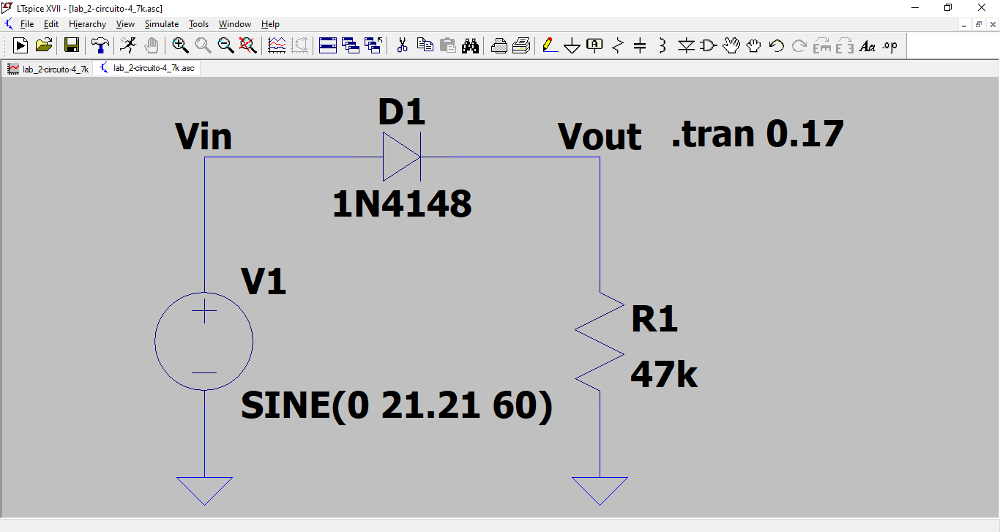
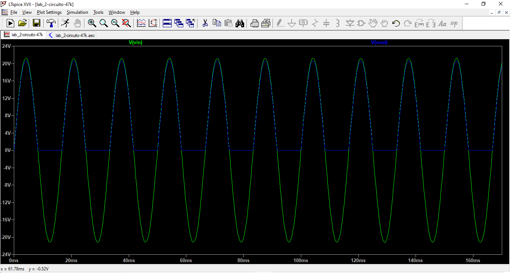
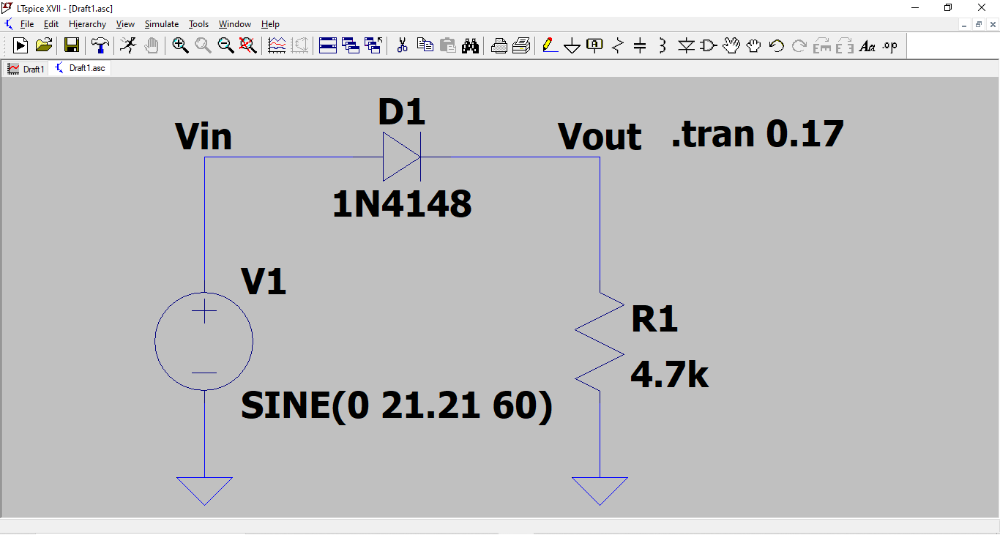

\thispagestyle{empty}

\newpage
\pagenumbering{roman}

```{=latex}
\setcounter{tocdepth}{4}
\renewcommand{\contentsname}{SUMÁRIO}
\tableofcontents
```

\newpage

```{=latex}
\setcounter{tocdepth}{4}
\renewcommand{\listfigurename}{LISTA DE FIGURAS}
\listoffigures
```

```{r Pacotes, message=FALSE, warning=FALSE, echo=FALSE}
library(knitr)
library(rmarkdown)
library(readr)
library(tibble)
library(magrittr)
library(dplyr)
library(tidyr)
library(data.table)
library(janitor)
```

\newpage

# OBJETIVO

Familiarizar-se com as aplicações básicas dos diodos de junção. Especificamente implementar e obter resultados experimentais do retificador de meia onda com e sem capacitor de saída.\

\pagenumbering{arabic}
\newpage

# PREPARATÓRIO

## Retificador de meia onda sem capacitor na saída
i. Tensões de entrada e saída comparar com as simulações.\

{width=80%}


{width=80%}


\newpage

{width=80%}


{width=80%}


\newpage

ii. Cálculo da tensão média na saída.\

\begin{equation}
  V_{Méd} = (V_M - V_K) \cdot (0,318)
\end{equation}

\begin{equation}
  V_{Méd} = (21,21 - 0,70) \cdot (0,318)
\end{equation}

\begin{equation}
  V_{Méd} = 6,52V
\end{equation}

iii. Cálculo da potência média de deverá dissipar a resistência da saída nos casos:\
  1. $R_L = 4.7k\Omega$\
  2. $R_L = 47k\Omega$\
iv. Qual é a tensão de pico inversa (PIV) suportada pelo diodo 1N4148, indicada pelo fabricante?\

A tensão de pico inversa do diodo (PIV ou PRV - Peak Reverse Voltage) é de grande importância nos projetos de retificação. Esta é a tensão máxima nominal do diodo que não deve ser ultrapassada na região de polarização reversa.\

Segundo o fabricante (Anexo 1) a tensão de pico inversa (PIV ou PRV) do diodo 1N4148 é de $100V$.\

\newpage

## Retificador de meia onda com capacitor na saída

i. Pesquisar como aproximar e calcular o valor de tensão pico-a-pico da ondulação (*Ripple*), em função de:\
  - Tensão de pico de entrada ($V_m$);\
  - Resistencia de saída($R_L$);\
  - Capacitor de saída($C_L$).\
ii. Cálculo o valor númerico da ondulação de pico-a-pico, nos casos $R_L = 4.7k\Omega$ e $R_L = 47k\Omega$. Comparar com os valores simulados no *LTSpice*.\

\newpage

# BIBLIOGRAFIA